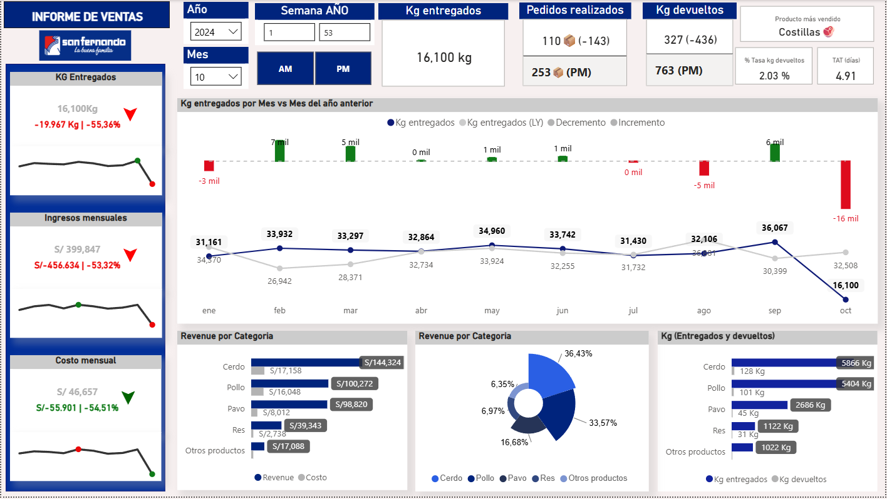

# 📈 Dashboard de Análisis de Ventas y Logística para Consumo Masivo

Este proyecto presenta un dashboard integral desarrollado en Power BI para monitorear y analizar el desempeño de ventas y la eficiencia logística en una empresa del sector de consumo masivo (productos cárnicos).

**Aclaración Importante:** Es fundamental señalar que este dashboard fue construido con **datos simulados y ficticios**, no con información real de ninguna empresa específica. El objetivo principal de este proyecto fue demostrar mis habilidades en el diseño de dashboards con **diversos estilos de visualizaciones** y el uso avanzado de **DAX (Data Analysis Expressions)** para cálculos complejos.

---

## 🔍 Contexto y Objetivos del Análisis

Este proyecto aborda la necesidad de monitorear el desempeño comercial y la eficiencia operativa en una empresa del sector de consumo masivo. Los objetivos clave fueron:
* Identificar tendencias de ventas e ingresos por categoría de producto.
* Analizar métricas logísticas como pedidos, entregas y la tasa de devoluciones.
* Proporcionar insights accionables para la toma de decisiones estratégicas.

---

## 📊 Dataset Utilizado

Los datos utilizados para este análisis son **completamente simulados** pero están diseñados para reflejar métricas y estructuras típicas de operaciones de retail y distribución de productos cárnicos. Incluyen:
* Registros de ventas detallados (productos, cantidades, precios).
* Información de pedidos y entregas (fechas de pedido, fechas de entrega).
* Registros de devoluciones (cantidad, motivo).
* Datos de productos (categorías, costos).

---

## 🛠️ Herramientas y Tecnologías

* **Power BI Desktop:** Modelado de datos, visualizaciones y diseño del dashboard.
* **Power Query:** ETL (Extracción, Transformación, Carga) de datos simulados.
* **DAX:** Creación de KPIs avanzados, medidas de tiempo (vs LY, vs PM) y cálculos complejos.

---

## 🧠 Metodología de Análisis

1.  **Ingesta y Preparación de Datos:** Los datos simulados fueron cargados y transformados utilizando Power Query para asegurar su calidad y adecuación para el análisis. Se realizaron pasos de limpieza, como [ej: manejo de valores nulos, corrección de tipos de datos, creación de columnas calculadas básicas].
2.  **Modelado de Datos:** Se estableció un modelo de datos robusto con relaciones claras entre las tablas de [ej: ventas, productos, clientes, fechas] para optimizar el rendimiento y la precisión de los cálculos.
3.  **Creación de KPIs y Métricas con DAX:** Se definieron métricas clave en DAX, tales como "Pedidos Realizados", "Kg entregados", "Kg devueltos", "Tasa de Devoluciones", "Días Promedio de Entrega", "Revenue Mensual", y "Costo Mensual", incluyendo comparaciones "vs LY (Last Year)" y "vs PM (Mes Pasado)". La complejidad y diversidad de las fórmulas DAX utilizadas fue un foco importante de este proyecto.
4.  **Diseño del Dashboard y Estilos Visuales:** Se diseñó una interfaz intuitiva y visualmente atractiva, experimentando con diversos estilos de visualizaciones (gráficos de tendencia, barras, circulares, tarjetas de KPI y tablas) para mostrar la capacidad de presentar información de manera efectiva y estéticamente agradable, facilitando la exploración de los datos por parte del usuario final.

---

## 📊 Visualizaciones Clave e Insights Destacados

El dashboard interactivo permite una exploración profunda, y aquí se presentan las vistas principales:

### Visión General del Rendimiento

Muestra KPIs clave del mes, producto TOP, y un resumen de las operaciones de entrega y devolución.

### Análisis de Tendencias y Composición por Categoría

Explora tendencias de Kg entregados, Revenue y Costo, junto con un desglose del rendimiento por categorías de producto.

---

## 💡 Conclusiones y Valor Aportado

A través de este análisis, se pueden identificar rápidamente:
* Los productos y categorías con mayor contribución al ingreso y su rentabilidad.
* Fluctuaciones en el volumen de entregas y el impacto de las devoluciones en la operación.
* Tendencias mensuales que permiten anticipar necesidades operativas o comerciales.

Este dashboard demuestra la capacidad de transformar datos brutos en información de negocio procesable, clave para optimizar la toma de decisiones y la estrategia operativa.

---

## 🧑‍💼 Autor

**Renato Cobeñas** 📧 rencou4@gmail.com  
[LinkedIn](https://www.linkedin.com/in/tuusuario)  
[GitHub](https://github.com/RenCoU4)
