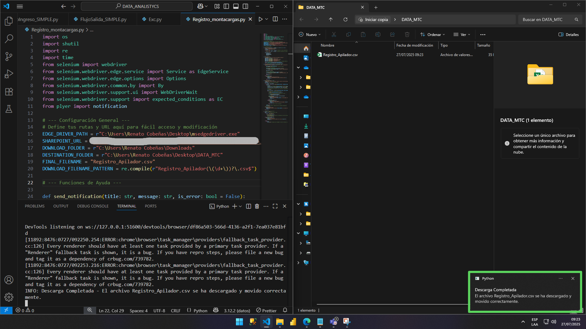
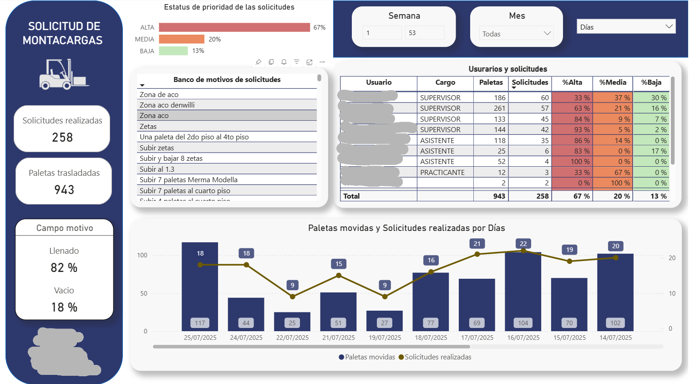
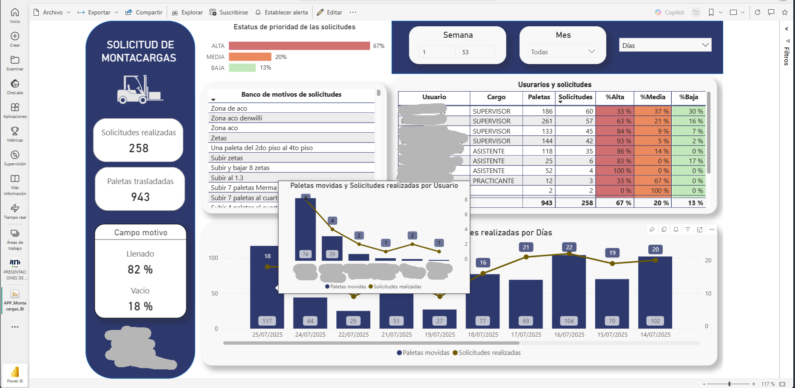
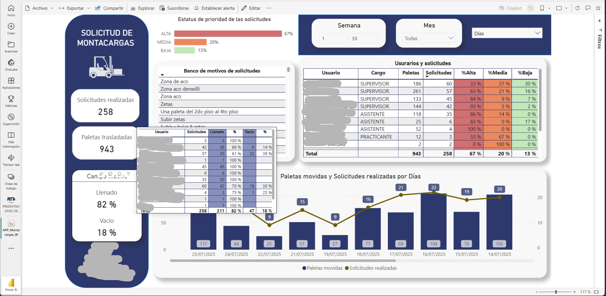

# 🚚 Automatización y Análisis Logístico

Este proyecto integra **Power BI** para el análisis y **Python** para la automatización, con el fin de **monitorear y optimizar las solicitudes de montacargas** en operaciones de almacén/logística.

**Nota:** Desarrollado con datos operativos **reales**, las capturas de pantalla están **censuradas** por confidencialidad. El foco es demostrar la metodología y tus habilidades técnicas.

---

## 🔍 Propósito y Solución

El objetivo fue simplificar la gestión de montacargas. La solución permite monitorear eficiencias, volumen de solicitudes y rendimiento del personal, ofreciendo información casi en tiempo real para decisiones operativas ágiles.

---

## 🛠️ Tecnologías Clave

* **Power BI Desktop:** Modelado de datos, visualización y diseño del dashboard.
* **DAX:** Creación de KPIs avanzados.
* **Python:** Script de automatización (con `Selenium` para extracción web).
* **Microsoft Power Apps & Lists (SharePoint):** Origen de los datos.
* **Power BI Service / Microsoft Fabric:** Publicación y actualización automática.
* **Programador de Tareas (Windows):** Orquestación del script Python.

---

## 🚀 Flujo de Datos Automatizado

El sistema opera un flujo continuo:
1.  Solicitudes generadas en **Power Apps** y almacenadas en **SharePoint Lists**.
2.  Un script de **Python** descarga automáticamente los datos cada 29 minutos.
3.  El dashboard de **Power BI** se actualiza automáticamente cada 30 minutos en **Power BI Service**, asegurando datos frescos.

---

## 📊 Vistas Clave

El dashboard proporciona insights interactivos:

### Dashboard Principal

Visión general de solicitudes, paletas trasladadas, estatus y rendimiento por usuario.

### Tooltip: Detalles por Usuario

Muestra información detallada de solicitudes, completadas y estatus al interactuar con datos de usuario.

### Tooltip: Detalles por Motivo

Desglosa los motivos y la frecuencia de las solicitudes al interactuar con el gráfico correspondiente.

---

## 💡 Impacto y Valor

* **Optimización Operativa:** Identifica cuellos de botella y mejora la asignación de recursos.
* **Decisiones Ágiles:** Acceso a información actualizada para una gestión más efectiva.
* **Reducción de Trabajo Manual:** La automatización robusta elimina tareas repetitivas y asegura la frescura de los datos.

---

## 🧑‍💼 Autor

**Renato Cobeñas** 📧 rencou4@gmail.com
[LinkedIn](https://www.linkedin.com/in/tuusuario)
[GitHub](https://github.com/RenCoU4)
