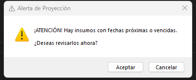
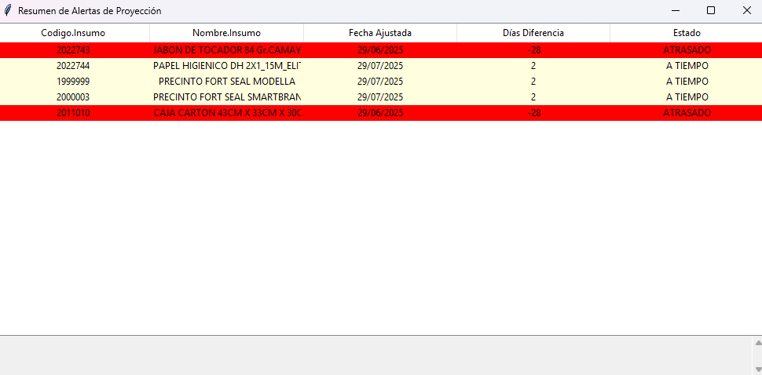
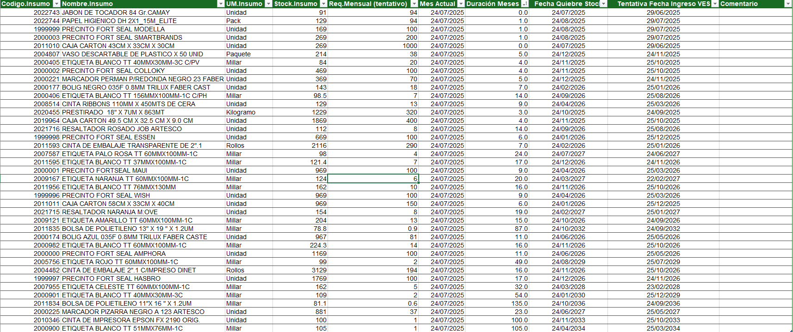
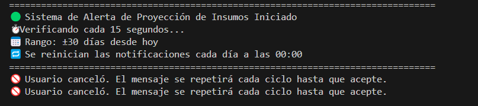

# 🔔 Sistema de Alerta de Insumos (Python)

Este proyecto es una **aplicación de escritorio desarrollada en Python** que automatiza el **monitoreo y alerta proactiva de fechas de corte de insumos**, crucial para una gestión eficiente de inventarios.

**Aclaración Importante:** Desarrollado para un contexto operativo real, este sistema muestra la aplicación de mis habilidades en automatización. 
---

## 🔍 Contexto y Propósito

El objetivo principal fue facilitar el seguimiento de insumos críticos, alertando al usuario sobre fechas próximas o vencidas para evitar desabastecimientos y optimizar el proceso de solicitud. Esta herramienta reduce la necesidad de revisiones manuales constantes, mejorando la eficiencia operativa.

---

## 🛠️ Herramientas y Tecnologías

* **Python:** Lenguaje principal de desarrollo.
    * **Pandas:** Para la lectura y manipulación de datos desde Excel.
    * **Tkinter:** Para la creación de la interfaz gráfica de usuario (GUI) de las alertas.
    * **Threading y Plyer:** Para un funcionamiento fluido en segundo plano y notificaciones del sistema.
* **Microsoft Excel:** Fuente de datos de los insumos.
* **Programador de Tareas (Windows Task Scheduler):** Para la ejecución automática y continua del sistema.

---

## 🚀 Funcionamiento Clave

El sistema lee periódicamente los datos de insumos desde un archivo Excel, calcula los días restantes hasta sus fechas de corte y **genera alertas visuales (pop-ups y tablas interactivas)** cuando los insumos requieren atención. Se configura para ejecutarse automáticamente, asegurando un monitoreo constante y proactivo.

---

## 📊 Vistas del Sistema

Aquí se muestran los componentes clave de la aplicación:

* **Mensaje de Alerta Emergente:** La notificación inicial al usuario.
    
* **Interfaz de Resumen de Alertas:** La ventana principal con la lista detallada de insumos críticos.
    
* **Fragmento del Código Python:** Una vista del código que impulsa la automatización.
    
* **Vista de la Fuente de Datos (Excel):** Cómo se organizan los insumos.
    
* **Consola de Ejecución:** Muestra el monitoreo en segundo plano.
    

---

## 📈 Impacto y Valor Aportado

* **Gestión Proactiva:** Transforma una revisión manual tediosa en un sistema de alerta automático, previniendo retrasos y desabastecimientos.
* **Eficiencia Mejorada:** Libera tiempo del usuario al automatizar el monitoreo de insumos críticos.
* **Soporte Operacional:** Proporciona una herramienta directa y tangible que mejora la toma de decisiones y la fluidez de las operaciones.

---

## 🧑‍💼 Autor

**Renato Cobeñas** 📧 rencou4@gmail.com
[LinkedIn](https://www.linkedin.com/in/tuusuario)
[GitHub](https://github.com/RenCoU4)
