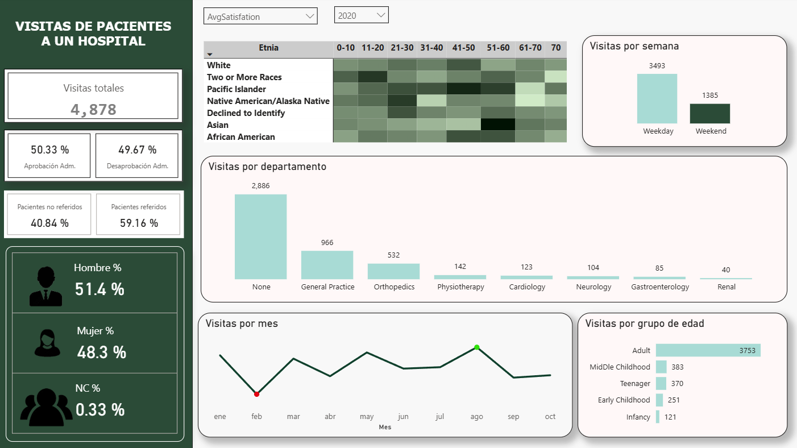

# 🏥 Análisis de Visitas y Satisfacción Hospitalaria

Dashboard en **Power BI** para analizar visitas y satisfacción en hospitales, ofreciendo una vista rápida de la demografía del paciente y su experiencia.

**Nota:** Datos simulados y ficticios.

---

## 🔍 Objetivos Clave

* Visualizar volumen de visitas, distribución por género y aprobación administrativa.
* Analizar satisfacción por etnia y edad (mapa de calor).
* Identificar patrones de visita (días/meses, picos y valles) y por departamento médico.

---

## 🛠️ Tecnologías

* **Power BI Desktop:** Modelado y visualización.
* **DAX:** Cálculos y métricas.

---

## 📊 Dashboard Principal

Visión integral de visitas, rendimiento y satisfacción. La gráfica mensual resalta visualmente los **picos máximos (verde) y mínimos (rojo)** de afluencia.

---

## 💡 Impacto

* **Decisiones Ágiles:** Información rápida para optimizar la atención y recursos.
* **Identificación de Oportunidades:** Resalta tendencias clave y períodos de demanda.

---

## 🧑‍💼 Autor

**Renato Cobeñas** 📧 rencou4@gmail.com
[LinkedIn](https://www.linkedin.com/in/tuusuario)
[GitHub](https://github.com/RenCoU4)
