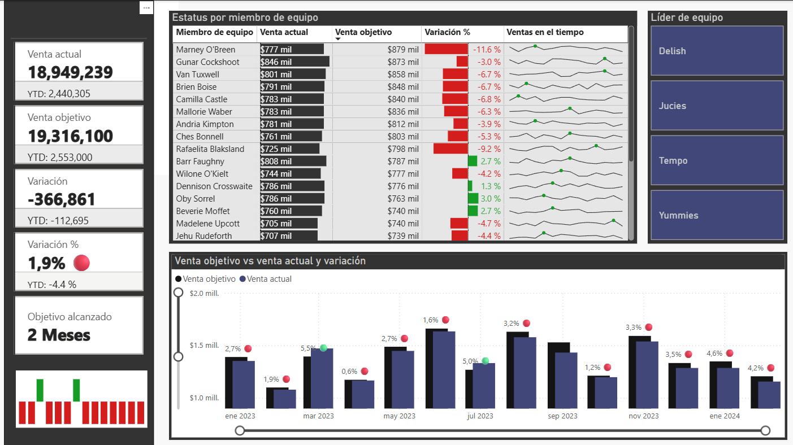

# 📈 Análisis de Rendimiento de Ventas

Este dashboard interactivo en **Power BI** permite un monitoreo detallado y una evaluación efectiva del rendimiento del equipo de ventas, comparando objetivos con resultados reales y detectando tendencias clave.

---

## 🔍 Propósito y Análisis Clave

El objetivo principal es proporcionar una visión clara del desempeño comercial. Este dashboard permite:
* **Seguimiento de KPIs:** Monitorear la venta actual, la variación respecto al objetivo y el progreso hacia metas.
* **Evaluación Individual:** Analizar el rendimiento de cada miembro del equipo de ventas, identificando fortalezas y áreas de mejora.
* **Análisis de Tendencias:** Visualizar la evolución de ventas a lo largo del tiempo, destacando meses con picos máximos (verde) y mínimos (rojo) para una mejor planificación.

---

## 🛠️ Tecnologías

* **Power BI Desktop:** Modelado de datos, creación de visualizaciones y diseño del dashboard.
* **DAX:** Para la creación de métricas y cálculos avanzados (ej. variación, objetivo alcanzado).

---

## 📊 Vistas Clave del Dashboard

A continuación, se presenta la vista principal del dashboard, la cual consolida la información más relevante:

### Dashboard Principal de Rendimiento de Ventas

Ofrece un resumen de los KPIs principales, un desglose del rendimiento por miembro de equipo, y una gráfica que compara las ventas reales y objetivo mes a mes, resaltando los momentos de mayor y menor variación.

---

## 💡 Impacto y Valor

* **Toma de Decisiones Estratégicas:** Facilita la identificación rápida de oportunidades y desafíos en el desempeño de ventas.
* **Gestión Eficaz de Equipos:** Permite a los líderes de equipo monitorear y apoyar el desempeño individual de manera proactiva.
* **Optimización de Estrategias:** Proporciona los insights necesarios para ajustar tácticas de ventas y mejorar resultados.

---

## 🧑‍💼 Autor

**Renato Cobeñas** 📧 rencou4@gmail.com
[LinkedIn](https://www.linkedin.com/in/tuusuario)
[GitHub](https://github.com/RenCoU4)
