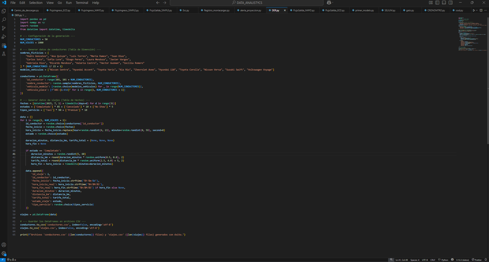
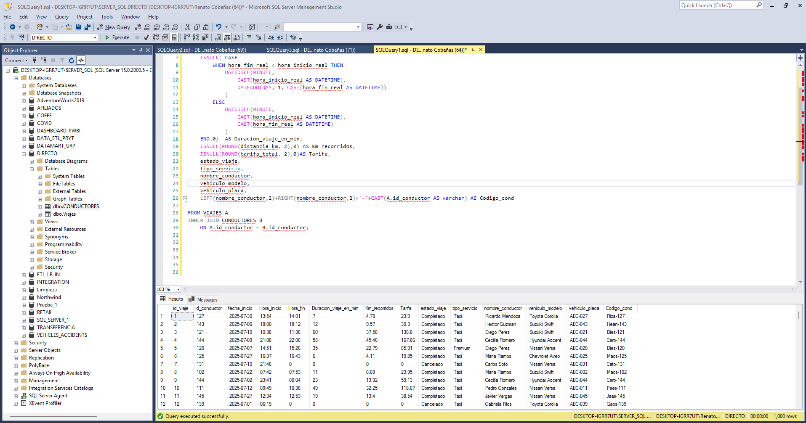
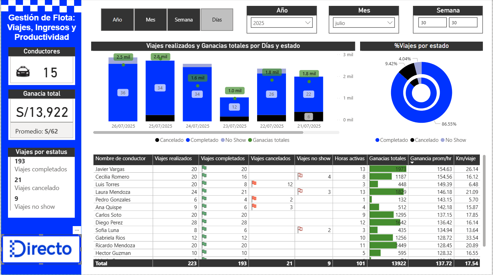

# 📈 Gestión de Flota: Viajes, Ingresos y Productividad - Proyecto DIRECTO

Este proyecto se enfoca en el análisis de las operaciones de una empresa de transporte (taxi) como DIRECTO. El objetivo fue crear un dashboard para el monitoreo diario de métricas clave de producción, optimizando la gestión de la flota y la toma de decisiones.

## ⚙️ Proceso del Proyecto y Herramientas Utilizadas

### 1. Generación y Adquisición de Datos
* **Herramienta:** Python (librería `pandas`)
* **Descripción:** Se utilizó Python para generar un dataset voluminoso y realista de más de 1000 filas, simulando las transacciones de viajes y la información de los conductores. Esto demuestra la capacidad de estructurar datos desde cero para un análisis robusto.

     

    

     

### 2. Limpieza y Modelado de Datos
* **Herramienta:** SQL (Microsoft SQL Server)
* **Descripción:** Los datos fueron importados a SQL Server para su limpieza y homologación. Se realizó un `INNER JOIN` entre la tabla de `viajes` y la de `conductores` para combinar la información transaccional con los datos descriptivos, preparando el dataset para el análisis.

     

    

     

### 3. Análisis y Visualización
* **Herramienta:** Power BI
* **Descripción:** Se desarrolló un dashboard interactivo enfocado en los KPIs de producción clave para DIRECTO, facilitando una visión clara y diaria del rendimiento de la flota.

     

    

     

---

## 📊 Dashboard y Métricas Clave

El dashboard permite una revisión proactiva de los siguientes indicadores, apoyando la toma de decisiones estratégicas:

* **Viajes por Conductor y por Estatus:** Permite identificar la productividad individual y monitorear la distribución de viajes completados, cancelados y "no-shows".
* **Ganancias Totales y Promedio por Hora:** Ofrece una visión clara de la rentabilidad de la operación y el valor generado por cada hora de servicio.
* **Productividad de la Flota:** A través de gráficos de tendencias, se puede observar el rendimiento de la flota a lo largo del tiempo.

---

## 💡 Impacto y Valor para DIRECTO

* **Toma de Decisiones Proactiva:** El análisis permite una identificación rápida de cuellos de botella y un desempeño deficiente.
* **Optimización de Recursos:** Facilita la asignación eficiente de conductores y la gestión de la flota para maximizar ingresos.
* **Mejora de la Experiencia:** Proporciona los insights necesarios para reducir las cancelaciones y los "no-shows", lo que mejora la satisfacción del cliente.

---

## 🧑‍💼 Autor

**Renato Cobeñas** 📧 rencou4@gmail.com
-   🔗 [LinkedIn](https://linkedin.com/in/renato-cobeñas)
-   💻 [GitHub](https://github.com/Rencou4)

---
